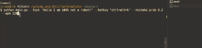

# HumanType ✨

<div align="center">
    
</div>


**HumanType** is a realistic typing simulator that mimics human typing behavior by typing one character at a time with random delays, occasional simulated mistakes, and configurable parameters. It’s perfect for automating typing in applications like Overleaf or any text editor while preserving a human-like behavior. 😎⌨️

## Features 🚀

- **Realistic Typing Simulation:**
  Mimics human typing by adding random delays between keystrokes, extra pauses for spaces, and even simulates mistakes with auto-backspacing.

- **Fully Configurable:**
  Customize typing speed (`wpm`), overall duration, mistake probability, random delay jitter, and more via command-line arguments.

- **Cross-Language Support:**
  Works with multiple languages (e.g. English, Chinese). Just ensure your system input method is set correctly. 🌐

- **Hotkey Start/Stop:**
  Start typing with a single hotkey (default: `CTRL+F9`) and stop anytime with the same hotkey. 🛑

- **Visual and Audio Feedback:**
  Plays a beep sound at the start and end (Windows only) to indicate when typing begins or stops.

## Demo 📽️

Below is a short demo of how HumanType works:

1. **Place the cursor** where you want the text to be typed.
2. **Press `CTRL+F9`** to start typing.
3. **Press `CTRL+F9` again** to stop the simulation, and the remaining text will be printed in the console.

<div align="center">
    
</div>


## Installation 🛠️

1. **Clone the Repository:**

   ```bash
   git clone https://github.com/sinmentis/HumanType.git
   cd HumanType
   ```

2. **Install dependency**
   ```bash
   python -m venv .venv  # Optional
   pip install -U -r requirements.txt
   ```